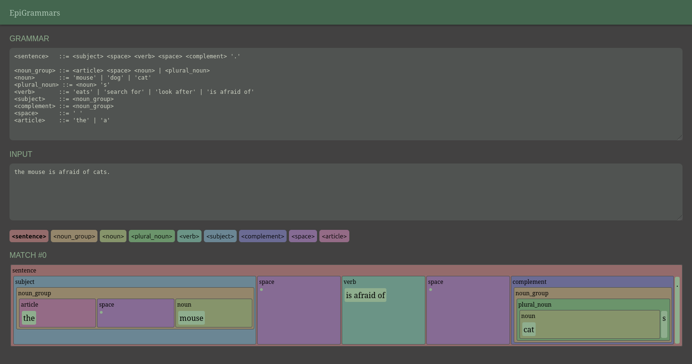

# EPIGrammars

A web playground for BNF formal grammars; 

## Online playground

Online playground can be accessed on [epigrammars.epigrapho.com](https://epigrammars.epigrapho.com/)

## Developpement setup

Requirements

- `cargo instal trunk` (to serve the leption client-side application)
- `cargo install stylance-cli` (to build styles)

Run in developpement

- `trunk serve --open`
- `stylance --watch .`

## Build

- `rm -r dist`
- `stylance .`
- `trunk build --release`
